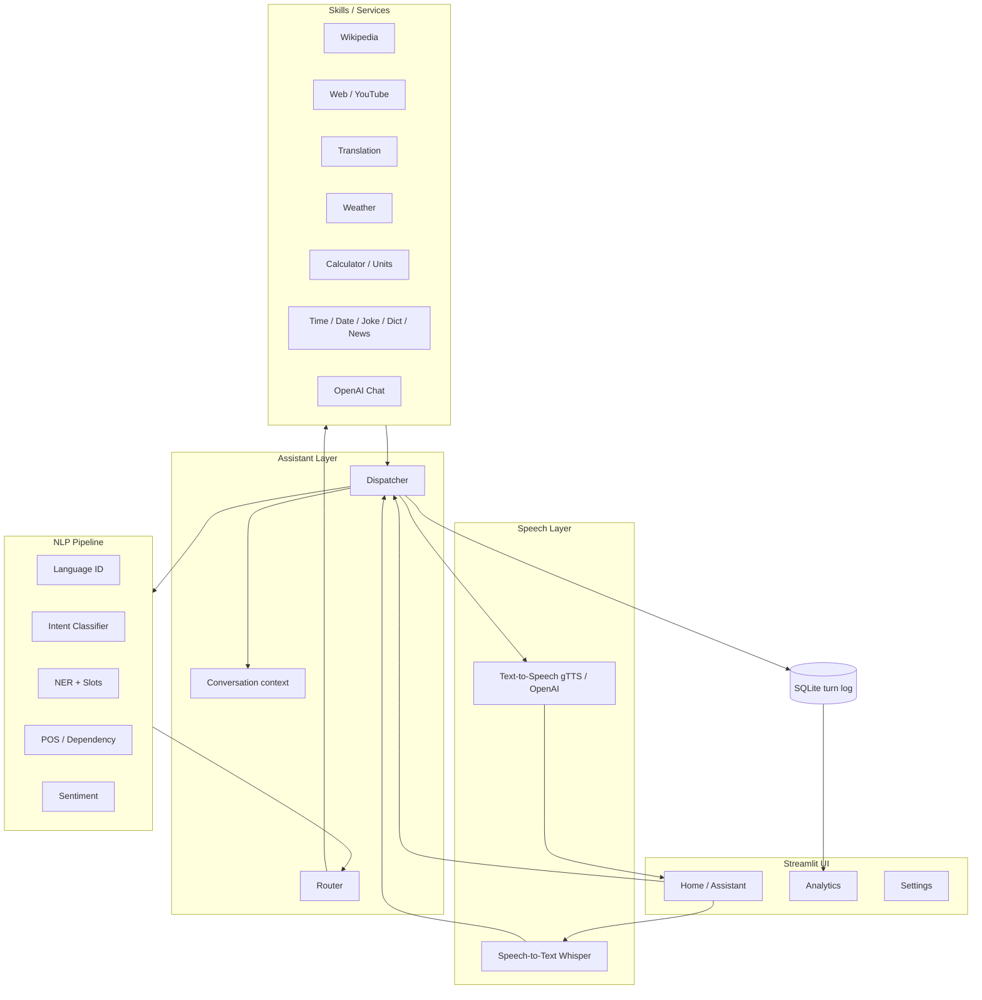
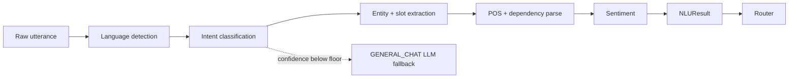

<div align="center">

# VINI AI

**An NLP-first voice assistant that understands intent, not keywords.**

[](https://www.python.org/)
[](https://streamlit.io/)
[](https://spacy.io/)
[](LICENSE)

</div>

VINI AI is a production-oriented voice assistant built around a real Natural
Language Understanding pipeline. Instead of a long `if/elif` chain matching
keywords, every request is classified by semantic similarity, its entities are
extracted into typed slots, and it is routed to the right skill through a plain
registry. The UI shows the full linguistic analysis - intent, confidence,
entities, POS tags, dependency parse, sentiment and language - for every single
message, so you can watch it think.

---

## Highlights

- **NLP-first, not keyword-first.** Intent classification via sentence
  embeddings or TF-IDF cosine similarity over a labelled example catalog, with
  a fuzzy fallback. Adding a skill means adding examples and one route - no
  branching logic to edit.
- **Full transparency.** Intent ranking, confidence meter, NER + slots, POS and
  dependency parse, sentiment and language are all rendered in expandable
  panels.
- **Real voice loop.** Browser microphone capture, Whisper speech-to-text, and
  spoken responses that play back in the browser - so it works when hosted, not
  only on a laptop.
- **Context-aware.** Multi-turn memory and follow-up resolution ("what about
  tomorrow?" keeps the previous city).
- **Analytics.** Every turn is logged to SQLite and charted: top intents,
  sentiment mix, language usage, confidence, latency and daily trends.
- **Deployable.** Runs on Streamlit Community Cloud on the free tier - no heavy
  models required, with optional upgrades gated behind config flags.

## Architecture



## NLP pipeline



## Quickstart

```bash
git clone https://github.com/vinith-bonila/vini-ai.git
cd vini-ai

python -m venv venv
source venv/bin/activate          # Windows: venv\Scripts\activate

pip install -r requirements.txt
python -m spacy download en_core_web_sm   # only if the wheel install is skipped

cp .env.example .env              # optional - add your OpenAI key
streamlit run app.py
```

Open http://localhost:8501. The assistant works immediately for structured
skills (music, translation, weather, calculator, Wikipedia, time, jokes, and
more). Add an OpenAI key in `.env` or the Settings page to enable open-ended
conversation and hosted Whisper voice.

## Configuration

All behaviour is driven by environment variables (see `.env.example`). Key ones:

| Variable | Default | Purpose |
|---|---|---|
| `OPENAI_API_KEY` | *(empty)* | Enables chat, hosted Whisper STT, OpenAI TTS |
| `USE_EMBEDDINGS` | `false` | Switch intent model to sentence-transformers |
| `USE_HF_SENTIMENT` | `false` | Switch sentiment to a transformer model |
| `STT_BACKEND` | `openai` | `openai` (hosted) or `local` (faster-whisper) |
| `TTS_BACKEND` | `gtts` | `gtts`, `openai`, or `pyttsx3` |
| `INTENT_CONFIDENCE_FLOOR` | `0.28` | Below this, requests defer to the LLM |
| `ALLOW_LOCAL_SYSTEM_SKILLS` | `false` | Allow opening desktop apps (local only) |

## Deploy to Streamlit Community Cloud

1. Push this repo to GitHub.
2. On [share.streamlit.io](https://share.streamlit.io), create an app pointing
   at `app.py`.
3. In **Advanced settings -> Secrets**, add your key:
   ```toml
   OPENAI_API_KEY = "sk-..."
   ```
4. Deploy. The spaCy model installs from the wheel pinned in
   `requirements.txt`, so no runtime download is needed.

**Deployment notes.** Voice input uses the browser microphone
(`st.audio_input`) and replies play back as audio in the browser, so the voice
loop works on a headless server. Desktop-only skills (opening local apps) are
disabled in hosted mode by design and clearly say so. The default intent model
(TF-IDF) and sentiment model (VADER) need no model downloads, keeping the app
inside free-tier memory; the embedding and transformer backends are opt-in for
environments with more headroom.

## Project structure

```
vini_ai/
├── app.py                 # Streamlit home / assistant page
├── ui.py                  # shared render helpers (brand, panels, meters)
├── config.py              # env-driven settings (single source of truth)
├── nlp/
│   ├── pipeline.py        # composes the full NLU analysis
│   ├── intents.py         # intent catalog (examples -> intents)
│   ├── intent_classifier.py
│   ├── ner.py             # spaCy NER + intent-aware slot extraction
│   ├── parser.py          # POS + dependency parse
│   ├── sentiment.py       # VADER / optional transformer
│   ├── language_detector.py
│   └── schemas.py         # typed NLU result objects
├── assistant/
│   ├── dispatcher.py      # single entry point: NLU -> route -> persist
│   ├── router.py          # intent -> handler registry
│   ├── conversation.py    # multi-turn context + follow-up resolution
│   └── schemas.py         # SkillResponse
├── services/              # one module per skill family
├── speech/                # speech_to_text.py, text_to_speech.py
├── database/history.py    # SQLite persistence + analytics queries
├── pages/                 # Analytics, Settings
├── utils/                 # logger, helpers
└── assets/                # theme css + diagram sources
```

## Design decisions

- **Semantic intent classification** keeps the assistant extensible and honest
  to the "NLP-first" brief. TF-IDF is the always-available default; embeddings
  are one flag away for better disambiguation of near-synonymous phrasings.
- **Typed slots** (`SONG`/`ARTIST`, `TEXT`/`TARGET_LANG`, `EXPRESSION`, ...) mean
  handlers receive clean structured input, not raw strings to re-parse.
- **Link-based actions** replace server-side browser control, which is the
  correct model for a hosted app - the UI renders buttons the user clicks.
- **Safe calculator** evaluates a restricted AST, never `eval()`, so no
  arbitrary code can run.
- **Graceful degradation** everywhere: missing API key, missing optional model,
  or failing service each fall back to a sensible, non-crashing path.

## Roadmap

- Wake-word / continuous listening mode
- Vector-store memory for long-term personalisation
- Per-user accounts and saved preferences
- Dockerfile and CI

## Author

Built by **Vinith Bonila**.
[LinkedIn](https://linkedin.com/in/vinith-bonila-1510bv) ·
[GitHub](https://github.com/vinith-bonila)

## License

MIT - see [LICENSE](LICENSE).
